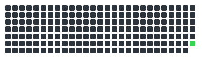

# Azure Data Engineer Job-Ready Portfolio

> Evidence repository for my Qode Clarity Azure Data Engineer program.



**6 days logged &middot; 1 weeks &middot; 1-day streak &middot; last activity 2026-07-18**

## Latest Proof

Quick recruiter review path — the newest 1-2 weeks of logged evidence.

| Date | Activity | Topic | Evidence |
| --- | --- | --- | --- |
| 2026-07-18 | Daily Concept Clinic | DQ Math 01 · Data Quality Issues Foundation | [evidence/cohorts/alpha-azure-cohort/week-01/daily-concept-clinic/Screenshot-4180-.png](https://github.com/scientistigwe/azure-data-engineer-roadmap/blob/main/evidence/cohorts/alpha-azure-cohort/week-01/daily-concept-clinic/Screenshot-4180-.png) |
| 2026-07-18 | Daily Concept Clinic | Daily Concept Clinic | Evidence for new update
[evidence/cohorts/alpha-azure-cohort/week-01/daily-concept-clinic/Screenshot-4181-.png](https://github.com/scientistigwe/azure-data-engineer-roadmap/blob/main/evidence/cohorts/alpha-azure-cohort/week-01/daily-concept-clinic/Screenshot-4181-.png) |
| 2026-07-18 | Daily Concept Clinic | Daily Concept Clinic | — |
| 2026-07-18 | Daily Concept Clinic | Daily Concept Clinic | — |

Full journal: [journal/index.md](journal/index.md)

## Program Summary

This repository tracks my journey from data foundations into practical Azure data engineering. It brings together Python, SQL, Docker, data modelling, Microsoft Fabric, Databricks, Azure services, infrastructure, and portfolio-ready cloud projects.
The goal is to provide evidence of cloud data pipelines that move data from raw ingestion to trusted analytics outputs, with clear design, build, documentation, and explanation.

## Target Roles

- Azure Data Engineer
- Analytics Engineer
- Data Platform Engineer
- Junior Cloud Data Engineer
- Python Data Engineer

## Core Skill Areas

| Area | Evidence this repo should contain |
| --- | --- |
| Foundations | Python ETL scripts, SQL modelling, Docker basics, Git workflow, and data quality checks |
| Microsoft Fabric and DP-700 | Lakehouse concepts, notebooks, semantic models, pipelines, and exam-aligned notes |
| Databricks | PySpark notebooks, Delta Lake workflows, medallion architecture, and scheduled jobs |
| Azure backend | FastAPI, queues, functions, monitoring, secrets, and service integration |
| Infrastructure | Terraform, Azure CLI, Azure DevOps, environment configuration, and deployment notes |
| Portfolio | End-to-end projects with architecture diagrams, screenshots, code, and operational evidence |
| Career readiness | Interview answers, certification notes, recruiter-facing README work, and project narratives |

## Study Path

| Phase | Focus | Outcome |
| --- | --- | --- |
| Setup | GitHub, local environment, Python, SQL, Docker | Ready-to-build engineering workspace |
| Foundation | ETL, SQL, data modelling, local services | Strong technical base for cloud data work |
| DP-700 | Microsoft Fabric concepts and exam objectives | Fabric data engineering readiness |
| Databricks | PySpark, Delta Lake, notebooks, jobs | Lakehouse implementation skill |
| Portfolio | Business-grade cloud data projects | Recruiter-facing evidence of real engineering work |
| Azure Backend | APIs, queues, functions, secrets, monitoring | Production-style data service integration |
| Azure Infrastructure | Terraform, CI/CD, cloud deployment | Repeatable infrastructure and deployment proof |
| Interview and Job Search | Mock interviews, CV, LinkedIn, GitHub proof | Clear positioning for data engineering roles |

## Repository Structure

```text
.
|-- journal/
|   |-- index.md
|   |-- week-01.md ...
|   `-- earlier.md
|-- assets/
|   `-- activity.svg
|-- notes/
|-- labs/
|-- projects/
|-- notebooks/
|-- src/
|-- infrastructure/
|-- screenshots/
|-- architecture/
`-- README.md
```

## How To Review This Work

1. Check the activity heatmap and Latest Proof table above for recent evidence.
2. Open [`journal/index.md`](journal/index.md) for the full week-by-week record.
3. Review the project folders for case studies, practical tasks, and end-to-end work.
4. Inspect the notes and source folders for tool-specific evidence.

## Project Review Rubric

| Area | What good evidence should show |
| --- | --- |
| Problem framing | The business or technical problem is stated clearly before the solution. |
| Reproducibility | A reviewer can find the files, run or inspect the work, and understand the setup. |
| Correctness | Outputs are validated with checks, screenshots, query results, logs, tests, or reconciliations. |
| Professional judgement | Trade-offs, assumptions, limitations, and next improvements are documented. |
| Communication | The README, journal, and project notes explain the work in plain language. |

## Interview Defense Prompts

Use these prompts to practise explaining any project in this repository:

- What problem did this project solve, and who would use the result?
- What input data, files, services, or assumptions did the work depend on?
- What validation proves the output is correct enough to trust?
- What failed, changed, or needed debugging while building it?
- What would be improved next for reliability, scale, cost, or usability?

## Peer Review Checklist

Use this checklist for capstones, portfolio projects, or cohort review sessions:

- Can a reviewer understand the problem in under one minute?
- Are the main files, commands, screenshots, or outputs easy to find?
- Does the project show validation rather than only a final result?
- Are assumptions, limitations, and next improvements written down?
- Is there one clear question the reviewer should answer after reading the project?

## Mock Interview Prompts

Use the latest evidence in `journal/index.md` to answer these out loud:

- Walk me through the most recent thing you built.
- Show me the file, query, dashboard, pipeline, or screenshot that proves it worked.
- What bug, data issue, or design trade-off did you handle?
- How would this work change if the data volume, users, or failure risk increased?
- What would you do differently if this were going into production?

## Final Portfolio Package

Before sharing this repository with a recruiter or interviewer, the strongest version should include:

- An up-to-date activity heatmap and Latest Proof table (both auto-generated on push).
- At least one finished project folder with source files, outputs, and setup notes.
- Screenshots, logs, query results, dashboard exports, or terminal output that prove the work ran.
- A project README that explains the problem, approach, validation, limitations, and next improvement.
- Interview notes that connect the work to the target role.

## What This Repository Proves

- Data pipelines show clear raw-to-trusted data flow.
- Project work spans Python, SQL, Spark, Fabric, Databricks, and Azure services.
- Architecture, operational checks, and deployment decisions are documented.
- Portfolio projects demonstrate cloud data engineering judgement.

---
